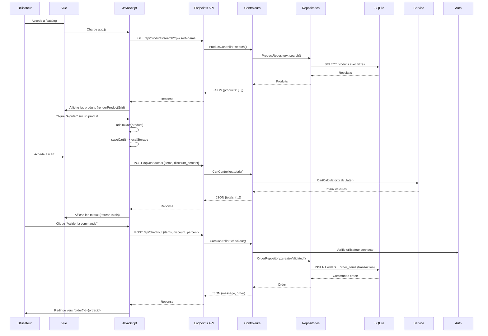

# TechStore Legacy - Cartographie Technique Complete

> **Document de reference** pour comprendre le fonctionnement de l'application TechStore Legacy
> *Version : 1.0* | *Date : 22/09/2026*

---

## 📋 SOMMAIRE

1. [Fonctionnalites et leurs implementations](#1-fonctionnalites-et-leurs-implementations)
2. [Architecture technique par couches](#2-architecture-technique-par-couches)
3. [Liens entre les pages et navigation](#3-liens-entre-les-pages-et-navigation)
4. [Flux de donnees et endpoints API](#4-flux-de-donnees-et-endpoints-api)
5. [Base de donnees](#5-base-de-donnees)
6. [Synthese visuelle](#6-synthese-visuelle)
7. [Annexe : Commandes utiles](#7-annexe--commandes-utiles)

---

---

## 1. FONCTIONNALITES ET LEURS IMPLEMENTATIONS

### 🔹 Fonctionnalite : Catalogue public de produits informatiques

| **Description** | **Fonction** | **Fichier** | **Type** |
|----------------|--------------|-------------|----------|
| Afficher la liste des produits | `PageController::catalog()` | `src/Controller/PageController.php:15-21` | Controleur |
| Recuperer tous les produits | `ProductRepository::all()` | `src/Repository/ProductRepository.php:15-18` | Repository |
| Rechercher et trier les produits | `ProductRepository::search()` | `src/Repository/ProductRepository.php:20-34` | Repository |
| Afficher la vue catalogue | - | `views/catalog.php` | Vue |
| Recherche dynamique (API) | `ProductController::search()` | `src/Controller/ProductController.php:16-27` | API |
| Afficher un produit specifique | `ProductController::show()` | `src/Controller/ProductController.php:29-40` | API |

---

### 🔹 Fonctionnalite : Recherche dynamique par nom et tri simple

| **Description** | **Fonction** | **Fichier** | **Type** |
|----------------|--------------|-------------|----------|
| Recherche cote serveur | `ProductRepository::search()` | `src/Repository/ProductRepository.php:20-34` | Repository |
| Endpoint de recherche API | `ProductController::search()` | `src/Controller/ProductController.php:16-27` | API |
| Recherche cote client (JS) | `searchCatalog()` | `public/assets/js/app.js:85-98` | JavaScript |
| Gestion des evenements de recherche | Event listeners | `public/assets/js/app.js:288-291` | JavaScript |

---

### 🔹 Fonctionnalite : Connexion avec jeton JWT

| **Description** | **Fonction** | **Fichier** | **Type** |
|----------------|--------------|-------------|----------|
| Afficher la page de login | `PageController::login()` | `src/Controller/PageController.php:23-26` | Controleur |
| Authentification (API) | `AuthController::login()` | `src/Controller/AuthController.php:20-44` | API |
| Verifier l'utilisateur courant | `AuthController::me()` | `src/Controller/AuthController.php:46-61` | API |
| Creer un token JWT | `JwtService::createToken()` | `src/Auth/JwtService.php:9-26` | Service |
| Lire un token JWT | `JwtService::readToken()` | `src/Auth/JwtService.php:28-44` | Service |
| Obtenir l'utilisateur courant | `AuthHelper::currentUser()` | `src/Auth/AuthHelper.php:17-36` | Helper |
| Trouver un utilisateur par email | `UserRepository::findByEmail()` | `src/Repository/UserRepository.php:24-30` | Repository |
| Vue de connexion | - | `views/login.php` | Vue |
| Gestion de la soumission du formulaire | `loginForm.submit` | `public/assets/js/app.js:294-314` | JavaScript |

---

### 🔹 Fonctionnalite : Panier local avec quantites et remises

| **Description** | **Fonction** | **Fichier** | **Type** |
|----------------|--------------|-------------|----------|
| Afficher la page panier | `PageController::cart()` | `src/Controller/PageController.php:28-31` | Controleur |
| Calculer les totaux | `CartController::totals()` | `src/Controller/CartController.php:22-29` | API |
| Valider la commande | `CartController::checkout()` | `src/Controller/CartController.php:31-68` | API |
| Calcul des montants | `CartCalculator::calculate()` | `src/Service/CartCalculator.php:9-32` | Service |
| Vue du panier | - | `views/cart.php` | Vue |
| Gestion du panier cote client | `addToCart()`, `renderCart()`, `refreshTotals()` | `public/assets/js/app.js:100-174` | JavaScript |
| Stockage local | `localStorage` (token, user, cart, discount) | `public/assets/js/app.js:5-10` | JavaScript |

---

### 🔹 Fonctionnalite : Validation de commande

| **Description** | **Fonction** | **Fichier** | **Type** |
|----------------|--------------|-------------|----------|
| Valider une commande (API) | `CartController::checkout()` | `src/Controller/CartController.php:31-68` | API |
| Creer une commande validee | `OrderRepository::createValidated()` | `src/Repository/OrderRepository.php:56-98` | Repository |
| Normalisation des articles | `CartController::normalizeItems()` | `src/Controller/CartController.php:70-93` | Controleur |
| Redirection apres validation | `checkout()` (JS) | `public/assets/js/app.js:176-197` | JavaScript |
| Afficher le detail de la commande | `PageController::orderDetail()` | `src/Controller/PageController.php:38-41` | Controleur |
| Vue detail commande | - | `views/order_detail.php` | Vue |
| Charger le detail (JS) | `loadOrderDetail()` | `public/assets/js/app.js:241-269` | JavaScript |

---

### 🔹 Fonctionnalite : Historique client

| **Description** | **Fonction** | **Fichier** | **Type** |
|----------------|--------------|-------------|----------|
| Afficher la page commandes | `PageController::orders()` | `src/Controller/PageController.php:33-36` | Controleur |
| Lister les commandes de l'utilisateur (API) | `OrderController::mine()` | `src/Controller/OrderController.php:18-32` | API |
| Trouver les commandes par utilisateur | `OrderRepository::findByUser()` | `src/Repository/OrderRepository.php:15-21` | Repository |
| Vue historique | - | `views/orders.php` | Vue |
| Charger les commandes (JS) | `loadOrders()` | `public/assets/js/app.js:199-217` | JavaScript |

---

### 🔹 Fonctionnalite : Consultation des commandes pour le responsable magasin

| **Description** | **Fonction** | **Fichier** | **Type** |
|----------------|--------------|-------------|----------|
| Afficher la page suivi magasin | `PageController::managerOrders()` | `src/Controller/PageController.php:43-46` | Controleur |
| Lister toutes les commandes validees (API) | `ManagerController::orders()` | `src/Controller/ManagerController.php:18-32` | API |
| Trouver les commandes validees | `OrderRepository::findValidatedOrders()` | `src/Repository/OrderRepository.php:23-32` | Repository |
| Lister les commandes validees (alternative) | `OrderController::mine()` (pour manager) | `src/Controller/OrderController.php:26-28` | API |
| Vue suivi magasin | - | `views/manager_orders.php` | Vue |
| Charger les commandes manager (JS) | `loadManagerOrders()` | `public/assets/js/app.js:219-239` | JavaScript |

---

---

## 2. ARCHITECTURE TECHNIQUE PAR COUCHES

```
┌─────────────────────────────────────────────────────────────────────────┐
│                            PRESENTATION (Vues)                            │
├─────────────────────────────────────────────────────────────────────────┤
│ public/                 views/                public/assets/              │
│  └── index.php          ├── layout.php       ├── css/                    │
│   └── (endpoints)       │   ├── catalog.php    │   └── app.css             │
│                        │   ├── login.php     └── js/                     │
│                        │   ├── cart.php       │   └── app.js              │
│                        │   ├── orders.php                              │
│                        │   ├── order_detail.php                        │
│                        │   ├── manager_orders.php                      │
│                        │   └── 404.php                                 │
└─────────────────────────────────────────────────────────────────────────┘
                                      ▼
┌─────────────────────────────────────────────────────────────────────────┐
│                          CONTROLEURS (Logique HTTP)                       │
├─────────────────────────────────────────────────────────────────────────┤
│ src/Controller/                                                          │
│  ├── BaseController.php    (methodes render(), json(), input())          │
│  ├── PageController.php    (pages HTML : catalog, login, cart, etc.)       │
│  ├── ProductController.php  (API produits : search, show)                 │
│  ├── AuthController.php     (API auth : login, me)                       │
│  ├── CartController.php     (API panier : totals, checkout)               │
│  ├── OrderController.php    (API commandes : mine, show)                  │
│  └── ManagerController.php  (API manager : orders)                       │
└─────────────────────────────────────────────────────────────────────────┘
                                      ▼
┌─────────────────────────────────────────────────────────────────────────┐
│                          SERVICES (Logique metier)                        │
├─────────────────────────────────────────────────────────────────────────┤
│ src/Service/                    src/Auth/                                 │
│  └── CartCalculator.php         ├── JwtService.php    (JWT create/read)   │
│     (calculate())               └── AuthHelper.php    (currentUser)       │
└─────────────────────────────────────────────────────────────────────────┘
                                      ▼
┌─────────────────────────────────────────────────────────────────────────┐
│                          REPOSITORIES (Acces donnees)                     │
├─────────────────────────────────────────────────────────────────────────┤
│ src/Repository/                                                           │
│  ├── ProductRepository.php    (all, search, find, candidatesForShopping)  │
│  ├── UserRepository.php        (find, findByEmail, all)                   │
│  ├── OrderRepository.php       (findByUser, findValidatedOrders,         │
│  │                              findWithItems, createValidated)           │
│  └── CategoryRepository.php    (non utilise directement)                │
└─────────────────────────────────────────────────────────────────────────┘
                                      ▼
┌─────────────────────────────────────────────────────────────────────────┐
│                          DATABASE (SQLite)                                │
├─────────────────────────────────────────────────────────────────────────┤
│ database/                          src/Database/                            │
│  ├── schema.sql                   └── Connection.php                      │
│  └── techstore.sqlite             (get(), reset())                       │
└─────────────────────────────────────────────────────────────────────────┘
                                      ▼
┌─────────────────────────────────────────────────────────────────────────┐
│                          SUPPORT (Utilitaires)                            │
├─────────────────────────────────────────────────────────────────────────┤
│ src/Support/                        scripts/                               │
│  └── helpers.php                  └── reset_database.php                  │
│    (format_price, project_path,     (reinitialisation BDD)                 │
│     legacy_env)                                                        │
└─────────────────────────────────────────────────────────────────────────┘
```

---

---

## 3. LIENS ENTRE LES PAGES ET NAVIGATION

### 🌐 Navigation principale (via `views/layout.php`)

```mermaid
graph LR
    A[/catalog] --> B[/cart]
    A --> C[/orders]
    A --> D[/manager/orders]
    A --> E[/login]
    B --> A
    C --> A
    D --> A
    E --> A
```

**Liens dans le header (`layout.php:10-20`)** :
- **TechStore Legacy** → `/catalog`
- **Catalogue** → `/catalog`
- **Panier** → `/cart`
- **Mes commandes** → `/orders`
- **Suivi magasin** → `/manager/orders` (visible uniquement pour les managers)
- **Connexion** → `/login` (masque si connecte)
- **Deconnexion** → Redirige vers `/catalog` (button)

---

### 📍 Routage centralise (`public/index.php`)

Toutes les requetes passent par ce fichier qui dispatch vers les controleurs appropriees :

| **URL** | **Controleur::Methode** | **Type** | **Description** |
|---------|------------------------|----------|-----------------|
| `/` ou `/catalog` | `PageController::catalog()` | Page | Affiche le catalogue |
| `/login` | `PageController::login()` | Page | Page de connexion |
| `/cart` | `PageController::cart()` | Page | Page du panier |
| `/orders` | `PageController::orders()` | Page | Historique des commandes |
| `/order` | `PageController::orderDetail()` | Page | Detail d'une commande |
| `/manager/orders` | `PageController::managerOrders()` | Page | Suivi magasin |
| `/api/products/search` | `ProductController::search()` | API | Recherche de produits |
| `/api/products/show` | `ProductController::show()` | API | Detail d'un produit |
| `/api/login` (POST) | `AuthController::login()` | API | Connexion |
| `/api/me` | `AuthController::me()` | API | Info utilisateur courant |
| `/api/cart/totals` (POST) | `CartController::totals()` | API | Calcul des totaux |
| `/api/checkout` (POST) | `CartController::checkout()` | API | Validation commande |
| `/api/orders` | `OrderController::mine()` | API | Commandes de l'utilisateur |
| `/api/orders/show` | `OrderController::show()` | API | Detail d'une commande |
| `/api/manager/orders` | `ManagerController::orders()` | API | Commandes validees (manager) |

---

### 🔗 Liens dans les vues

| **Vue** | **Liens/Actions** | **Destination** |
|---------|------------------|----------------|
| **`catalog.php`** | Bouton "Voir le panier" | `/cart` |
| **`catalog.php`** | Bouton "Ajouter" (produit) | Ajoute au panier local (JS) |
| **`login.php`** | Formulaire submit | POST `/api/login` → redirige `/catalog` |
| **`cart.php`** | Bouton "Valider la commande" | POST `/api/checkout` → redirige `/order?id={id}` |
| **`orders.php`** | Bouton "Ouvrir" (commande) | `/order?id={order.id}` |
| **`manager_orders.php`** | Bouton "Ouvrir" (commande) | `/order?id={order.id}` |
| **`order_detail.php`** | - | - |
| **`404.php`** | Bouton "Retour au catalogue" | `/catalog` |

---

---

## 4. FLUX DE DONNEES ET ENDPOINTS API

### 📊 Flux utilisateur standard



---

### 📋 Tableau des endpoints API

| **Endpoint** | **Methode** | **Controleur** | **Authentification** | **Description** | **Retour** |
|--------------|-------------|----------------|---------------------|-----------------|------------|
| `/api/products/search` | GET | `ProductController::search()` | ❌ Non | Recherche et tri des produits | `{products: [...]}` |
| `/api/products/show` | GET | `ProductController::show()` | ❌ Non | Detail d'un produit | `{product: {...}}` ou 404 |
| `/api/login` | POST | `AuthController::login()` | ❌ Non | Connexion utilisateur | `{token, user}` ou 401 |
| `/api/me` | GET | `AuthController::me()` | ✅ Oui | Info utilisateur courant | `{user}` ou 401 |
| `/api/cart/totals` | POST | `CartController::totals()` | ❌ Non | Calcul des totaux | `{totals: {...}}` |
| `/api/checkout` | POST | `CartController::checkout()` | ✅ Oui (customer) | Validation commande | `{message, order}` ou erreurs |
| `/api/orders` | GET | `OrderController::mine()` | ✅ Oui | Liste commandes utilisateur | `{orders: [...]}` ou 401 |
| `/api/orders/show` | GET | `OrderController::show()` | ✅ Oui | Detail d'une commande | `{order: {...}}` ou 404 |
| `/api/manager/orders` | GET | `ManagerController::orders()` | ✅ Oui (manager) | Commandes validees | `{orders: [...]}` ou 403 |

---

---

## 5. BASE DE DONNEES

### 🗃 Schemas (database/schema.sql)

| **Table** | **Champs** | **Relations** |
|-----------|------------|---------------|
| **users** | id, email, password_hash, first_name, last_name, role | - |
| **categories** | id, name | - |
| **products** | id, category_id, name, description, price_cents, available | FK → categories(id) |
| **orders** | id, reference, user_id, status, discount_percent, discounted_subtotal_cents, tax_cents, total_cents, created_at | FK → users(id) |
| **order_items** | id, order_id, product_id, product_name, unit_price_cents, quantity, line_total_cents | FK → orders(id), products(id) |

**Index** :
- `idx_products_category` sur `products(category_id)`
- `idx_orders_user` sur `orders(user_id)`
- `idx_orders_created_at` sur `orders(created_at)`

---

---

## 6. SYNTHESE VISUELLE

### 🎯 Synthese par fonctionnalite

| **Fonctionnalite** | **Pages** | **API** | **Services** | **Repositories** | **Vues** | **JS** |
|--------------------|-----------|---------|--------------|------------------|----------|--------|
| **Catalogue** | `/catalog` | `/api/products/search`, `/api/products/show` | - | `ProductRepository` | `catalog.php` | `searchCatalog()`, `addToCart()` |
| **Recherche** | `/catalog` | `/api/products/search?q=...&sort=...` | - | `ProductRepository::search()` | - | `searchCatalog()` |
| **Authentification** | `/login` | `/api/login`, `/api/me` | `JwtService`, `AuthHelper` | `UserRepository` | `login.php` | `loginForm.submit` |
| **Panier** | `/cart` | `/api/cart/totals`, `/api/checkout` | `CartCalculator` | `ProductRepository`, `OrderRepository` | `cart.php` | `renderCart()`, `refreshTotals()`, `checkout()` |
| **Commandes client** | `/orders`, `/order` | `/api/orders`, `/api/orders/show` | - | `OrderRepository` | `orders.php`, `order_detail.php` | `loadOrders()`, `loadOrderDetail()` |
| **Suivi magasin** | `/manager/orders` | `/api/manager/orders` | - | `OrderRepository` | `manager_orders.php` | `loadManagerOrders()` |

---

### 🔄 Flux complet de l'application

```
Utilisateur non connecte :
    /catalog -> (voir produits) -> /login -> POST /api/login -> /catalog (connecte)
    /catalog -> (ajouter au panier) -> /cart -> POST /api/checkout -> /order?id=X

Utilisateur connecte (customer) :
    /catalog -> /cart -> /orders -> /order?id=X

Utilisateur connecte (manager) :
    /catalog -> /manager/orders -> /order?id=X

API internes :
    /api/products/search -> ProductRepository::search()
    /api/login -> UserRepository::findByEmail() -> JwtService::createToken()
    /api/me -> AuthHelper::currentUser() -> JwtService::readToken()
    /api/cart/totals -> CartCalculator::calculate()
    /api/checkout -> OrderRepository::createValidated() (transaction)
    /api/orders -> OrderRepository::findByUser() ou findValidatedOrders()
```

---

---

## 7. ANNEXE : COMMANDES UTILES

```bash
# Installation
composer install
cp .env.example .env
php scripts/reset_database.php

# Lancement
php -S localhost:8000 -t public

# Tests
vendor/bin/phpunit
# ou
composer test
```

**Comptes de test** :

| Nom | Email | Mot de passe | Role |
|-----|-------|--------------|------|
| Alice Martin | alice.martin@example.test | password | customer |
| Bob Dupont | bob.dupont@example.test | password | customer |
| Sophie Bernard | sophie.bernard@example.test | password | manager |

---

---

## 📌 RESUME EXECUTIF

### Points cles a retenir :

1. **Architecture** : MVC classique avec separation claire entre controleurs, services, repositories et vues
2. **Authentification** : JWT stocke en localStorage, verifie via header `Authorization: Bearer {token}`
3. **Panier** : Stockage local (localStorage) avant validation, pas de persistance serveur avant checkout
4. **Commandes** : Creation atomique via transaction SQLite, statut "validated" par defaut
5. **Roles** : Deux roles - `customer` (acces a ses commandes) et `manager` (acces a toutes les commandes validees)
6. **Navigation** : Tout passe par `public/index.php` qui route vers les controleurs
7. **API REST** : Endpoints sous `/api/` avec methodes appropriees (GET/POST)

### Fichiers centraux :
- **Entree unique** : `public/index.php` (router manuel)
- **Controleurs** : Tous dans `src/Controller/`
- **Logique metier** : `src/Service/` et `src/Auth/`
- **Donnees** : `src/Repository/` + `src/Database/Connection.php`
- **Frontend** : `views/` (PHP) + `public/assets/js/app.js` (toute la logique client)

---

*Document genere pour faciliter le developpement et la maintenance de TechStore Legacy*
